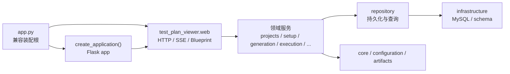

# Waterfall AI 架构说明

本文说明 Waterfall AI 当前的模块边界、依赖方向、运行时装配方式和维护规则。代码职责发生迁移时，应在同一变更中更新本文。

> **公开文档说明**
>
> 本文已按公开仓库口径审查，不记录真实部署地址、个人绝对路径、客户资料、账号或凭据、私有服务拓扑。此类信息只应存在于部署者的私有 runbook 中。
>
> 当前 Beta 支持边界是可信环境、单租户、单应用实例和 Linux Docker。本文的模块说明不构成对公网、多租户、高可用或生产被测系统的安全承诺。

## 文档导航

- [公开架构概览](./docs/architecture.md)
- [安全模型](./docs/security-model.md)
- [配置参考](./docs/configuration.md)
- [部署指南](./docs/deployment.md)
- [支持矩阵](./docs/support-matrix.md)

## 1. 架构目标

平台采用“兼容入口 + 分层模块 + 按功能前端”的渐进式架构：

- 对外继续兼容 `app:app`、现有 HTTP/SSE 路径、JSON 字段和静态资源 URL。
- `app.py` 是兼容装配根，负责把运行时依赖、领域服务和 Flask Blueprint 连接起来。
- 领域规则不依赖 Flask，也不反向导入 `app.py`。
- MySQL、文件系统、进程和网络能力通过显式依赖对象传入，便于测试和替换。
- 浏览器端按功能工厂拆分，`app.js` 负责共享状态和最终装配。
- Jinja partial 与功能 CSS 文件按界面职责拆分，同时保持稳定的 DOM hook 和级联顺序。

运行时的主要逻辑依赖方向如下：



该图表达职责方向，不代表装配根必须逐层调用：`app.py` 会直接构造 Web、Domain、Repository 和 Infrastructure 的依赖对象；`create_application()` 当前只创建 Flask shell、设置 session 安全默认值并注册 `index`。允许的业务依赖方向仍是从外层指向内层。`test_plan_viewer/**` 不得导入旧入口 `app`；除 `test_plan_viewer/web/**` 外，包内模块不得导入 Flask。这两条规则由测试门禁检查。

## 2. 运行入口与装配

### `app.py`

`app.py` 保留以下职责：

- 暴露部署入口 `app:app`，兼容 `python app.py` 和现有 WSGI 配置。
- 调用 `test_plan_viewer.web.create_application()` 创建 Flask 应用。
- 初始化进程级锁、任务注册表和兼容常量。
- 用显式 `Dependencies` / `Services` 对象连接领域模块与外部能力。
- 保留迁移期的薄兼容函数，使现有调用方和 `patch.object(app, ...)` 测试可以逐批迁移。
- 注册 Blueprint。

兼容包装必须只做参数转发、依赖装配或返回值适配。新业务规则不应继续写入包装函数。

当前仍是渐进迁移期，而不是“入口已经完全清空”的状态。Agent 主工作流装配、其余生成/执行 SSE、项目数据库基线操作、测试资产编辑及部分执行记录接口仍暂留在 `app.py`；它们是后续迁移边界，不是新增代码的默认落点。项目 Seed 生成的 HTTP/SSE 边界已迁至 `web/seed.py`，固定模板、模式识别、完成判定、并发租约和产物收口由 `generation/seed.py` 负责。逐脚本的生成、执行、一次自动修复、复验、模型分析和人工操作状态机由 `agent/script_preparation.py` 拥有；`script_preparation/` 通过独立仓储、任务原子和模块适配器在普通脚本页复用该状态机，不创建或修改 Agent run。`web/agent_script_preparation.py` 和 `web/module_script_preparation.py` 分别交付两种业务语义。装配根只注入持久化、模型、脚本操作和时间等外部能力。已抽出的诊断、脚本准备、验证、Prompt 和结果解析能力不能回填到入口。

### `test_plan_viewer/web/`

该目录是 Flask 交付层，可读取 `request`、`session` 和 `g`，并负责：

- URL 与 HTTP method；
- 请求解析和响应状态码；
- `jsonify`、文件下载、重定向与模板渲染；
- 将异常转换成稳定的 API 错误结构；
- 调用注入的领域服务。

Blueprint 的 endpoint 名称不是外部契约；URL、method、状态码、JSON/SSE 结构才是稳定契约。

当前已迁移的交付边界如下：

| Blueprint | 已拥有的路由范围 |
| --- | --- |
| `index` | 首页 `/` |
| `auth` | 登录、当前用户、用户/角色/权限管理（12 条） |
| `platform_records` | 平台兼容记录读取与保存（2 条） |
| `projects` | 项目列表、创建与项目设置读写（4 条） |
| `seed` | 项目 Seed 生成流（1 条） |
| `project_archive` | 项目 ZIP 导入与导出（2 条） |
| `setup` | 准备脚本、绑定、运行记录与试运行（10 条） |
| `requirements` | 需求和候选模块的非流式 CRUD（8 条） |
| `page_inventory` | 页面清单 CRUD 与文档导入（5 条） |
| `test_suites` | 测试集及测试集条目的非执行接口（8 条） |
| `agent_script_preparation` | Agent 脚本准备快照、详情、单项操作和批量操作（4 条） |
| `module_script_preparation` | 普通模块脚本准备运行、详情、单项/批量操作与取消（6 条） |

同一路由族中除脚本准备外仍留在 `app.py` 的 Agent HTTP、项目 Seed 测试与数据库测试、需求分析与计划生成流、计划/脚本生成执行流、测试集执行、jobs 和 assets 接口不应被误认为已迁移；迁移时继续使用独立 Blueprint，并先补齐 SSE 与失败状态 parity 测试。

## 3. 后端目录职责

```text
test_plan_viewer/
├── agent/              # Agent 脚本准备状态机、诊断包及独立失败分析能力
├── artifacts/          # 中文资产命名、安全路径、生成前后快照
├── auth/               # 登录、角色、权限的策略与领域规则
├── core/               # 无框架通用验证
├── execution/          # Playwright 命令、结果解析、报告和视频证据
├── generation/         # 计划/脚本 Prompt、cases 拆分与 Seed 生成领域规则
├── infrastructure/     # MySQL 方言、连接和 schema 迁移
├── page_inventory/     # 页面清单模型、项目级仓储与导入服务
├── platform_records/   # 兼容记录与任务的持久化仓储
├── projects/           # 项目模型、仓储、工作区、归档校验与导入/导出
├── repositories/       # 跨领域表名与基础仓储能力
├── requirements/       # 需求文件、候选模块、仓储和非流式服务
├── script_preparation/ # 普通模块脚本准备适配、原子操作、仓储与装配
├── setup/              # 准备脚本、绑定、执行器和编排服务
├── test_suites/        # 测试集模型、仓储和业务服务
├── web/                # Flask application factory 与 Blueprints
├── configuration.py    # 配置读取、默认值和配置校验
└── process_output.py   # 子进程输出解码、纠错和摘要
```

各层约定：

| 层 | 可以依赖 | 不应承担 |
| --- | --- | --- |
| `web` | 领域服务、序列化结果、Flask | SQL、文件系统细节、核心业务判断 |
| 领域 `service` | model、repository、显式外部能力 | Flask request/session、全局 `app` |
| `repository` | 本领域 model/validation、configuration、表名和注入的数据库能力 | HTTP 响应、页面状态 |
| `infrastructure` | 标准库、数据库驱动、configuration | 具体页面或业务流程 |
| `core` / `configuration` / `artifacts` | 标准库及更内层纯工具 | Flask、领域仓储 |

### 显式依赖对象

涉及 I/O 或进程状态的模块使用不可变 dataclass，例如：

```python
@dataclass(frozen=True)
class ExampleDependencies:
    now_ms: Callable[[], int]
    read_text: Callable[[Path], str]
    write_text: Callable[[Path, str], None]
```

装配根传入 lambda，使兼容测试仍可在调用时替换 `app.py` 中的能力。不要在模块导入时捕获项目路径、当前用户或数据库连接。

### 项目与作者上下文

`test_plan_viewer.projects.context` 维护当前项目和作者上下文。普通 HTTP 请求通过 `get_requested_project_key()` 与 `get_current_project()` 按 `X-Project-Key`、query 或 session 动态解析项目；后台线程和单项重试必须显式进入 `use_project_context()` / `use_author_context()`，不能依赖启动时的默认项目。

路径计算必须从当前项目根目录派生，并经过 `artifacts.paths` 或对应领域的安全路径校验。任何可由请求控制的路径都要防止 `..`、绝对路径和符号链接逃逸。

### 后台任务与持久化

- 进程内注册表和锁只管理当前进程中的取消、互斥和流式状态。
- 可恢复或需要刷新后继续展示的状态写入 MySQL。
- 完整日志和 Playwright 产物保存在当前项目工作区；MySQL 保存状态、尾部日志和产物索引。
- 后台线程启动时要复制项目/作者上下文，结束时清理进程内任务状态。
- SSE 终态必须与数据库终态一致；失败和取消也必须发出可解析的最终事件。
- Agent 进入 `awaiting_script_action` 时属于持久化暂停点；SSE 必须发送 `paused` 后结束连接，不能把等待人工处理误报为失败或让流无限保持。
- 普通模块脚本准备写入 `script_preparation_runs`；运行、动作队列、最新脚本修订和外部 job 都必须有服务端持久化与并发保护，不得仅依赖浏览器状态或进程内锁。

### Agent 七阶段主流程

产品只展示以下七个主阶段，并保持左侧导航顺序稳定：

1. 需求；
2. 需求解析；
3. 模块审查；
4. 计划生成；
5. 脚本准备；
6. 测试集；
7. 执行。

`prepare_scripts` 是一个主阶段，不再把生成、执行、修复和失败处置展示为四个平级阶段。每个脚本在该阶段中独立运行唯一状态机：生成后执行；首次执行失败后自动修复并复验；复验仍失败时调用模型生成分析、建议动作和补充 Prompt，然后进入 `awaiting_human`。一个脚本等待人工时不阻塞其余脚本继续准备。

人工处理支持人工编辑、重新执行、放弃、重新生成和重新修复。每次操作都追加不可变历史节点；人工编辑和重新修复继承当前最新脚本版本，重新执行使用最新版本，重新生成继承原始 Prompt 与可编辑补充 Prompt 但不继承代码内容，放弃脚本不得进入测试集。批量操作按脚本分别使用各自 Prompt，并以 `accepted` / `rejected` 返回逐项结果。

普通计划页的“批量生成并准备”不再由浏览器串行调用生成 SSE，而是一次创建模块脚本准备 run，然后立即进入脚本页的“脚本准备” Tab。服务端继续处理生成→执行→一次修复→复验→人工的同一历史；即使尚未生成任何脚本，页面也以 run 中的模块上下文展示。普通 run 成功后只标记准备完成，不创建测试集；“忽略”仅跳过本次准备，不删除脚本资产。

## 4. 前端装配

浏览器端继续使用无需打包器的经典脚本，按以下顺序装载：

```text
static/js/core/*
    ↓
static/js/features/*
    ↓
static/app.js
```

当前精确加载顺序是：

```text
api-client → sse → timers
→ test-suites → requirements → platform-record-store
→ generation → script-repair → module-execution
→ module-plan-generation → admin → projects
→ project-settings → setup-preparation
→ agent-script-preparation → module-script-preparation → agent
→ app.js
```

`core` 提供 API、SSE 和 timer 等无业务共享能力。每个 `features/*.js` 暴露一个经典工厂，例如：

```javascript
function createExampleFeature(deps) {
  // 优先通过 deps 访问共享状态、DOM、API 和其他功能
  return { render, load, dispose };
}
```

`app.js` 保留：

- 页面级共享状态；
- DOM 引用和跨功能选择；
- 创建功能实例并注入依赖；
- 顶层导航、页面切换和 `bootstrap()`；
- 尚在迁移中的兼容调用面。

显式依赖是新代码和后续迁移的目标规则。当前 `agent`、`setup-preparation` 等模块仍有少量直接 `window` / `document` / timer 访问；普通 JSON 请求应复用共享 API 封装，流式请求和文件下载可以显式使用 `fetch`。功能模块不得复制 SSE parser、timer 清理或持久化算法；共享能力放入 `core`，跨功能状态通过显式 adapter 注入。

当前功能文件包括：

| 文件 | 主要职责 |
| --- | --- |
| `core/api-client.js` | 项目 header、JSON 请求和统一错误 |
| `core/sse.js` | 分片 SSE 解析 |
| `core/timers.js` | 可清理的 interval/timeout 运行时 |
| `features/platform-record-store.js` | 平台记录归一化、缓存和持久化 |
| `features/projects.js` | 项目选择、创建、导入和导出 |
| `features/project-settings.js` | 项目配置、seed 生成和连接测试 |
| `features/admin.js` | 用户、角色和权限管理 |
| `features/requirements.js` | 需求列表、解析和需求计划生成 |
| `features/test-suites.js` | 测试集列表、详情、执行和记录 |
| `features/generation.js` | 计划与脚本生成流 |
| `features/module-plan-generation.js` | 模块计划选择、创建脚本准备 run 和导航 |
| `features/script-repair.js` | 单脚本执行、取消和修复 |
| `features/module-execution.js` | 模块批量执行与批量修复 |
| `features/setup-preparation.js` | 准备脚本和绑定配置 |
| `features/agent-script-preparation.js` | Agent/普通模块共用的脚本列表、动态历史、人工操作编辑器和逐项批量操作 |
| `features/module-script-preparation.js` | 普通模块脚本准备 API、轮询、Tab 导航与业务文案适配 |
| `features/agent.js` | Agent 任务、事件、七阶段时间线及脚本准备功能装配 |

功能文件通过 `tests/js/*.vm.js` 在 Node VM 中测试。测试应覆盖工厂装配、状态转换、SSE 分片、终态清理和持久化 adapter，而不依赖真实浏览器。

## 5. 模板与样式

### Jinja 模板

`templates/index.html` 保留页面骨架和装载顺序，大块独立 UI 放入 `templates/partials/`。

以下内容属于稳定浏览器契约：

- 现有 `id`；
- Agent 使用的 `data-agent-id` 以及脚本准备宿主内按 scope 唯一的 `data-script-preparation-id`；
- 表单字段名和按钮事件 hook；
- 脚本与样式 URL 的相对顺序。

拆 partial 时必须对“渲染后的 HTML”检查唯一 ID，不能只检查源文件。

### CSS

`static/styles.css` 保存 token、reset、共享布局和通用组件，并通过文件顶部的 `@import` 装入功能样式。Agent 样式因现有装载契约以独立 `<link>` 位于共享样式之后。

```text
styles.css
├── css/features/setup-preparation.css
├── css/features/requirements.css
├── css/features/test-suites.css
├── css/features/admin.css
└── css/features/project-settings.css

css/features/agent.css  # 独立 link，后加载
css/features/agent-script-preparation.css  # Agent/模块共用的脚本准备列表与详情弹窗
```

移动规则时必须保持原选择器文本、同特异性规则的相对顺序和媒体查询语义。相关测试会比较选择器所有权、重复/泄漏和关键级联顺序。

## 6. 稳定契约

渐进式拆分不能改变以下外部行为：

- `app:app` 和本地启动方式；
- 已登记的 HTTP URL 与 method；
- API 状态码、JSON 字段和错误结构；
- SSE event 名称、分片解析和最终事件；
- `X-Project-Key` 项目选择；
- 页面 DOM hook；
- 静态资源 URL 与依赖顺序；
- 项目工作区中的计划、脚本、日志和产物路径；
- MySQL 表结构和已有数据迁移语义。
- Agent 主阶段固定为需求、需求解析、模块审查、计划生成、脚本准备、测试集和执行。
- 脚本准备历史按真实操作动态追加；成功、失败和待人工状态不能覆盖已有节点。
- 自动流程最多执行一次自动修复；复验仍失败必须进入人工处理，不能无限重试。
- 只有 `ready` 脚本可以进入测试集，`abandoned` 脚本必须排除；全部脚本均放弃时跳过测试集和执行阶段，以 `succeeded_with_unresolved` 安全结束，禁止创建空测试集。
- 普通模块脚本准备使用 `/api/script-preparation-runs`；创建请求必须幂等，单项/批量动作必须保留逐项结果并以修订 CAS 防止覆盖人工更新。

契约由不同层次的测试共同维护：

- `tests/test_architecture_contracts.py`：URL/method、DOM hook、静态资源和加载顺序；
- `tests/test_app_composition.py`：Blueprint 归属和动态装配；
- `tests/test_web_foundations.py`：包依赖方向与 Flask 边界；
- domain、regression 与 Node VM 测试：JSON/SSE、路径、状态转换和兼容行为。

新增对外接口时先更新对应契约；仅移动 endpoint 所属模块时不应改变 URL。

## 7. 如何扩展

### 新增后端领域

1. 在 `test_plan_viewer/<domain>/model.py` 放纯验证、状态转换和序列化。
2. 在 `repository.py` 放查询和写入，数据库表名与连接通过依赖传入。
3. 在 `service.py` 编排事务、文件与领域规则。
4. 在 `test_plan_viewer/web/<domain>.py` 创建 Blueprint，只处理 HTTP。
5. 在 `app.py` 构造 Dependencies/Services 并注册 Blueprint。
6. 添加 direct domain tests、isolated Blueprint tests 和 URL contract。
7. 若替换旧实现，先保留薄包装并增加新旧 parity 或兼容 patch 测试。

### 新增前端功能

1. 在 `static/js/features/` 创建单一工厂。
2. 将 state、DOM、API、timer 和其他功能作为 `deps` 注入。
3. 在 `index.html` 中把脚本放在依赖之后、`app.js` 之前。
4. 在 `app.js` 装配工厂，不复制实现。
5. 添加 VM 测试、功能所有权测试和静态资源顺序测试。
6. 大块 HTML 放入 partial；专用样式放入 feature CSS。

## 8. 验证

在 `test-plan-viewer` 目录执行：

```bash
python -m unittest discover -s tests -p "test_*.py"
python -m py_compile app.py test_plan_viewer/**/*.py
git diff --check
```

前端文件至少执行语法检查和 VM 回归：

```bash
node --check static/app.js
find static/js tests/js -name "*.js" -print0 | xargs -0 -n1 node --check
```

完成影响页面装配的变更后，还要用真实浏览器检查：

- 首页和主要菜单可进入；
- 无重复 DOM ID；
- 所有脚本和样式返回 200；
- 控制台无 error；
- SSE 或异步功能结束后 timer/连接被清理；
- 登录启用和关闭两种模式均无重定向循环。

## 9. 迁移与维护规则

维护规则以职责归属、依赖方向和可验证的外部契约为准，不以文件行数作为通过或
失败条件。文件增长时应检查内聚性和边界是否仍然清晰；需要拆分时，把完整职责放入
对应领域、Blueprint、前端 feature 或 partial，而不是为了满足机械指标拆分代码。

项目级 i18n 的语言加载、项目切换刷新和兼容 Prompt 入口仍由旧装配层协调；翻译
字典、项目语言领域逻辑及主要 Prompt 构造器分别归属前端 i18n、projects 与
generation/requirements 模块。后续新增语言或文案应遵守这些职责边界。

- 优先按完整业务能力迁移，不按“工具函数数量”拆文件。
- 领域模块必须能绕过 Flask 做 direct test。
- 不允许新模块导入 `app.py`，也不允许用隐式全局字典代替显式依赖。
- 兼容包装只在存在调用方时保留；确认调用方迁移并有契约测试后删除。
- 不制造只有转发作用的碎片模块。
- 修改模块归属、依赖方向、外部契约、前端装载顺序或主要目录时，同步更新本文。
- 每次模块化批次都运行专项测试；所有批次合并后运行全量与真实浏览器回归。
