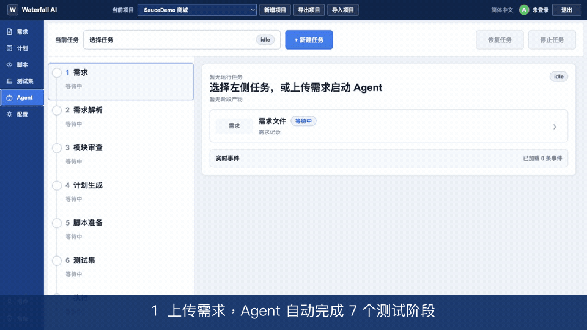

<p align="right"><a href="./README.md">English</a></p>

<h1 align="center">Waterfall AI</h1>
<p align="center"><strong>Agent 驱动的自动化测试平台</strong></p>

<p align="center">
把测试需求变成可审查的测试计划、可运行的 Playwright 测试和完整执行证据。<br>
在一个自托管工作区中，由 AI Agent 完成规划、生成、审查、执行与修复。
</p>

<p align="center">
  <a href="https://github.com/jiongfeng/waterfall-ai-test-platform/actions/workflows/ci.yml"></a>
  <a href="https://github.com/jiongfeng/waterfall-ai-test-platform/releases"></a>
  <a href="./LICENSE"></a>
  <a href="./docs/support-matrix.md"></a>
</p>

<p align="center">
  <a href="#agent-驱动的工作流"><strong>了解工作流</strong></a> ·
  <a href="./docs/deployment.md"><strong>安装已签名 Beta</strong></a> ·
  <a href="./docs/security-model.md"><strong>了解安全边界</strong></a>
</p>

<p align="center">
  
</p>

## Agent 驱动的工作流

| 规划 | 生成 | 执行与修复 |
| --- | --- | --- |
| 把需求转换为可审查的 Markdown 计划 | 由 Agent 生成 Playwright 测试，并保留本地 Git 历史 | 真实执行测试、收集证据、修复失败并复验结果 |

> **公开 Beta：**当前已签名预发布版本仅支持可信团队在 Linux/amd64 Docker
> 上进行单租户部署；只支持全新安装，不是敌对代码安全沙箱。

Waterfall AI 是基于 Playwright 构建的独立开源项目，与 Microsoft 或 Playwright
项目不存在隶属、赞助或官方背书关系。

## 主要能力

- 项目、需求、测试计划、脚本和测试集管理；
- 工作区测试资产的本地 Git 版本；
- 基于 OpenCode 的计划、生成、审查、修复和 Agent 流程；
- Playwright 执行，以及日志、报告、截图、视频和 trace；
- 项目级准备脚本、绑定和执行记录；
- 登录认证、角色、菜单权限和按 HTTP method 授权的 API；
- MySQL 元数据、项目导入导出、诊断和恢复记录。

界面和工作流仍在演进。采用 Beta 前请阅读[路线图](./ROADMAP.md)、
[变更日志](./CHANGELOG.md)和[支持矩阵](./docs/support-matrix.md)。
代码边界和扩展规则见 [ARCHITECTURE.md](./ARCHITECTURE.md)。

## 安全边界

受支持的部署假设：

- 只有一个组织和一个信任域；
- 运维人员、平台用户、仓库、生成代码和准备脚本均可信；
- Linux/amd64 Docker 上只运行一个应用实例；
- 被测系统已获授权、隔离、可恢复且不是生产环境；
- 网络只允许访问必要的 MySQL、OpenCode/模型服务和被测系统；
- 平台前方配置 TLS 和外部访问控制。

Playwright 测试和准备脚本会执行代码。它们与平台共享应用容器的操作系统边界，
**不能**作为敌对代码运行沙箱。默认关闭开关和容器限制只能减少误暴露，
不能把容器变成沙箱。不要给不可信用户执行权限，不要挂载 Docker Socket，也
不要连接生产凭据或生产数据。

完整边界见[安全模型](./docs/security-model.md)和
[部署指南](./docs/deployment.md)。

## Docker 快速开始（源码检出）

只有某个公开 Beta GitHub Release 实际附带经过验证的 Linux/amd64 bundle、
Minisign 签名清单和外层校验材料时，该 Release 才是可安装制品。在线包以不可变 GHCR
digest 引用平台镜像；只有全部第三方镜像的再分发审核通过后，Release 才会附带
完整离线包。没有该附件时，不得把当前 Release 描述为完整离线发行物。源码树和
其中的 NO-GO 模板本身不是安装包；构建验证和安装验证必须消费同一个平台镜像
digest。

源码检出仍可从 `deploy/Dockerfile` 本地构建。Playwright 基础镜像和应用直接依赖
固定版本，项目模板使用已提交的 npm lock；但部分构建工具和传递依赖仍由上游
registry 解析。正式候选因此以一次构建所得的镜像 digest 和 SBOM 为身份，不能承诺
日后源码重建必然逐字节相同。除非摘要与 Release 元数据一致，否则不得把本地重建
镜像称为 Release 镜像。

以下命令适用于源码检出。Release bundle 必须严格执行部署指南中可复制的
[下载、签名、外层校验和与安全 `--extract-to`
流程](./docs/deployment.md#release-下载验证与安全解包)。verifier 必须来自同一可信
tag，并从权限受限的已验证副本直接复制到不存在的目标。解包后先运行
`./bin/preflight`，再运行 `./bin/install --target 绝对路径`；安装后的副本只通过
`./bin/platform-compose` 管理。缺少当前 Release 资产时，不得拿历史内部包替代。

### 前置条件

- Linux/amd64 主机（源码固定镜像和 Release runtime 都是单平台 amd64 制品）；
- Docker Engine 和 Compose v2 插件；
- Git；
- Python 3，用于下面的本地秘密生成片段；
- 足够容纳镜像、浏览器、MySQL 卷、工作区和测试产物的磁盘空间。

所有命令必须始终使用同一个运维身份；该身份应预先通过经批准的 rootless Docker、
专用 Docker group 账号或一致的 `sudo` 策略获得 daemon 访问权。Docker daemon 权限
事实上等同宿主 root 权限。不要混用提权和非提权命令，否则 `.runtime`、配置和生成
文件会出现不同所有者。

### 1. 准备配置

在仓库根目录中执行：

```bash
cp deploy/config.example.json config.json
cp .env.example .env
chmod 600 config.json .env
```

生成相互独立的快速开始秘密，秘密值不会出现在进程命令参数中。脚本还会把数据
库和 OpenCode 服务密码复制到本地 `config.json`，与应用恢复后的文件密码字段
保持一致：

```bash
python3 - <<'PY'
from pathlib import Path
from secrets import token_urlsafe
import json

path = Path(".env")
config_path = Path("config.json")
secret_names = {
    "PLATFORM_SESSION_SECRET",
    "PLATFORM_ADMIN_PASSWORD",
    "PLATFORM_DB_PASSWORD",
    "OPENCODE_SERVER_PASSWORD",
    "MYSQL_ROOT_PASSWORD",
}
result = []
secrets = {}
for line in path.read_text(encoding="utf-8").splitlines():
    name, separator, value = line.partition("=")
    if separator and name in secret_names:
        value = value or token_urlsafe(36)
        secrets[name] = value
        line = f"{name}={value}"
    result.append(line)
path.write_text("\n".join(result) + "\n", encoding="utf-8")

config = json.loads(config_path.read_text(encoding="utf-8"))
config["opencode_password"] = secrets["OPENCODE_SERVER_PASSWORD"]
config["platform_database"]["password"] = secrets["PLATFORM_DB_PASSWORD"]
config_path.write_text(
    json.dumps(config, ensure_ascii=False, indent=2) + "\n",
    encoding="utf-8",
)
PY
```

初始管理员用户名是 `admin`，密码是本机 `.env` 中的
`PLATFORM_ADMIN_PASSWORD`。此时 `.env` 与 `config.json` 都含秘密，不要提交、
粘贴或上传其中任何一个文件。

### 2. 校验并启动

```bash
./deploy/platform-compose preflight-install
./deploy/platform-compose validate-config
./deploy/platform-compose up --build --detach
./deploy/platform-compose ps
```

`up --build` 只属于源码部署路径。包装脚本只拉取本机缺少且已固定 linux/amd64
digest 的 MySQL 镜像，只构建一次 platform 镜像，然后用
`--no-build --pull never` 启动两个平台服务。基础 runtime Compose 本身不能从源码
构建。包装脚本还只从模式为 `0600` 的 `.env` 解析唯一 Compose project identity，
如果环境中的 `COMPOSE_PROJECT_NAME` 与之冲突会直接拒绝。

第一条命令是源码检出的全新安装保护：它与之后所有包装命令使用同一个受控 project
identity，运行目标必须为空，而且该 Compose project 不能已有容器、卷或网络。只在
第一次 `up` 前运行；已安装当前版本的日常管理直接使用 `platform-compose`，不要
重复运行全新安装检查。

三个服务均健康后，打开
[http://127.0.0.1:5000](http://127.0.0.1:5000)，使用 `admin` 登录。
随后可运行 `./deploy/platform-compose verify`，检查健康状态、容器只读契约、配置
可读性，以及 OpenCode 四个 XDG 卷和必要 data/state 子目录的权限与可写性。

容器健康只证明平台、MySQL 和 OpenCode 服务进程能通过本地检查，**不代表**模型
Provider 已配置、认证成功或能够完成推理。因此 UI 和非 Agent 功能可能已经就绪，
而 Agent 功能仍未就绪。开启 Agent 工作流前，应配置组织批准的 Provider，并使用
不含真实测试数据或秘密的最小请求完成一次认证推理冒烟测试。

Docker 示例故意把被测地址设为保留域名
`https://test.example.invalid`。运行或生成浏览器自动化前，必须在
`config.json` 中替换为已获授权的测试系统地址，并把该项目的 `username` 和
`password` 设置为专用测试账号。

`platform-compose` 是该栈唯一受支持的操作入口。它会校验宿主 `config.json` 的
模式必须为 `0600`，再把规范化内容暂存到
`deploy/.runtime/secrets/platform-config.json`。运行时目录模式为 `0700`，暂存
文件模式为 `0444`；宿主上的私有父目录负责阻止其他用户读取。这个被 Git 忽略的
运行副本仍含秘密：不得直接编辑或提交，不得进入公开/未加密备份，也不得作为诊断
附件分享。修改源配置后，保持其模式为 `0600`，再执行
`./deploy/platform-compose apply-config`。

不支持直接运行 `docker compose`，因为这会绕过配置校验和暂存流程。

常用命令：

```bash
./deploy/platform-compose logs --follow platform
./deploy/platform-compose down
```

`down` 会保留命名卷；包装脚本拒绝 `-v` / `--volumes`，因为删除卷会销毁 MySQL
数据、工作区和服务状态。

如果 OpenCode 因已有 config、data、cache 或 state 卷的 owner/mode 不正确而拒绝
启动，不要删除卷，也不要绕过检查继续使用。先停止 OpenCode，对四个 OpenCode
卷创建同一恢复点的加密、访问受限快照，并在修复前后记录每个卷的 identity 和
非秘密 sentinel 的 SHA-256。快照可能包含 OAuth/Provider 配置和日志，绝不能进入
仓库或公开 Issue。完成快照后运行：

```bash
./deploy/platform-compose repair-opencode-volumes
./deploy/platform-compose verify
```

显式修复命令只解析带有受控 Compose project label 的四个卷，从本机平台镜像动态
读取运行 UID/GID，只修 owner、受控目录 mode，并只创建缺失的受控运行目录，再以非 root 运行身份逐卷写入探测；
全部通过后才重建 OpenCode。只有镜像、capability、project 和四卷预检都通过后，
命令才停止 OpenCode；从开始改变卷状态起，任何修复或健康失败都会保持停止，预检
失败则不改变原服务状态。此时应先排查或恢复四卷快照。兼容命令 `repair-state`
仍然只修 state 卷。

### 3. 显式开启可信测试执行

测试执行默认关闭。完成被测系统、仓库、脚本、网络、挂载和产物策略检查后，在
`.env` 中设置：

```dotenv
PLATFORM_ALLOW_TEST_EXECUTION=true
```

然后重建平台服务：

```bash
./deploy/platform-compose up --detach --force-recreate platform
```

公开 Compose 清单始终保持
`PLATFORM_ALLOW_HOST_SCRIPT_EXECUTION=false`。准备脚本是任意 shell 代码，
只有可信运维人员提供经过专门加固的自定义部署时才应启用。开启任何执行开关都
代表接受代码执行风险，不代表获得安全沙箱。

## 配置与秘密

为兼容原有行为，`config.json` 保存 OpenCode 密码、平台数据库密码，以及各被测
系统的登录用户名和密码。该文件不得进入源码仓库，只允许服务账号读取，并且只
能进入加密且访问受限的备份。

| 环境变量 | 用途 |
| --- | --- |
| `PLATFORM_SESSION_SECRET` | 覆盖文件中的 `auth.session_secret` |
| `PLATFORM_ADMIN_PASSWORD` | 覆盖文件中的 `auth.initial_admin_password` |
| `PLATFORM_DB_PASSWORD` | Compose 的 MySQL 账号密码；同一值还要写入 `platform_database.password` |
| `MYSQL_ROOT_PASSWORD` | Compose 初始化 MySQL 的 root 密码 |
| `OPENCODE_SERVER_PASSWORD` | Compose 的 OpenCode 服务密码；同一值还要写入 `opencode_password` |
| `PLATFORM_COOKIE_SECURE` | HTTPS 部署时设为 `true` |
| `PLATFORM_ALLOW_TEST_EXECUTION` | 显式允许执行可信 Playwright 代码 |
| `PLATFORM_ALLOW_HOST_SCRIPT_EXECUTION` | 显式允许可信准备 shell；公开 Compose 中保持禁用 |

“生成 Seed”提供“访问目标系统（不登录）”和“带登录”两种模式。访问 Seed 使用
固定脚本，只访问 `base_url`，不创建模型任务，也不会把登录地址、用户名或密码
写入 Seed；登录 Seed 沿用模型生成流程，会把配置的登录信息提供给模型。两种
模式都会覆盖同一个 `tests/seed/seed.spec.ts`。

平台仍可能把被测系统用户名和密码放入规划/脚本生成 Prompt 或登录 Seed。只能
使用隔离非生产环境中的可撤销、最小权限测试账号，并把模型提供方、工作区 Git、
日志和执行产物都视为该凭据的暴露边界。

Compose 快速开始固定使用 `deploy/config.example.json` 中的数据库名和应用
账号。如需修改任一标识，必须同时更新 `deploy/compose.yaml` 的 MySQL 服务，
以及复制后的根 `config.json` 中的 `platform_database.database` /
`platform_database.user`；只修改一侧会导致平台无法连接数据库。

完整字段和优先级见[配置参考](./docs/configuration.md)。

## 数据库基线：仅支持 file 模式

旧 command 模式以及 `backup.bat`、`restore.bat` 已删除。
`database_baseline` 只接受 `mode: "file"`，用于复制文件型测试数据库：

- `baseline_path` 不存在时，将当前 `database_path` 复制为基线；
- 基线已存在时，在相关测试流程前把基线复制回运行数据库；
- 使用锁目录串行化操作。

示例：

```json
{
  "database_baseline": {
    "enabled": true,
    "mode": "file",
    "database_path": "/data/playwright-projects/default/data/test.db",
    "baseline_path": "/data/playwright-projects/default/.baseline/test.db",
    "lock_path": "/data/playwright-projects/default/.baseline/restore.lock",
    "timeout_seconds": 300
  }
}
```

禁止指向生产数据。MySQL 等服务型数据库不是 command baseline 目标；如确需
自动重置，应使用单独评审的准备流程和最小权限测试凭据。

## 敏感产物

Playwright 报告、截图、视频、trace、浏览器下载、工作区 Git 历史、日志和
诊断包都可能包含 Cookie、表单值、个人信息、页面内容或内部 URL。不存在能够
可靠覆盖所有自由文本和二进制产物的自动清理机制。

- 只允许可信用户访问产物；
- 配置保留期限和安全删除；
- 加密备份，并把 `mysql_data`、`platform_projects`（含 file baseline）、
  `platform_workspaces` 及所有工作区 Git 历史、OpenCode 四个 XDG 卷和
  `config.json`/`.env`/Release 元数据视为同一恢复点；
- 分享前人工复核每个诊断包；
- 不要把原始报告、trace、视频、配置或数据库转储附到公开 Issue。

## 品牌与发布兼容性

项目已由 `playwright-test-platform` 更名为 `waterfall-ai-test-platform`，GitHub 会将
旧仓库地址重定向到新地址。不可变的 `v0.1.0-beta.3` Release 会保留原有
`playwright-test-platform-*` 制品名和
`ghcr.io/jiongfeng/playwright-test-platform` 镜像地址；改名后的新 Release 使用
Waterfall AI 命名。为保障现有部署兼容，`playwright_platform` 数据库、Python 包路径、
容器内部路径和既有 Session Cookie 名称保持不变。

## 仅支持全新安装的升级边界

当前公开 Beta **只支持全新安装**，不支持从内部安装包、旧部署、源码检出版本，
或者缺失/无法识别 Release 元数据的环境原地升级。旧内部增量包已经退役，不属于
公开 Release 资产，也不构成公开兼容性承诺。

- Release 安装目标必须不存在；即使目录为空，也要先人工确认并显式移除，同时使用
  全新的数据库卷和应用卷；
- 不得把本版本直接指向旧数据库、工作区、Compose 项目或卷；
- 只读检查 `deploy/preflight-install.py` 与
  `deploy/upgrade-matrix.json` 会拒绝所有未明确列出的来源；当前矩阵没有任何受支持
  的原地升级路径；
- 不得通过只删除版本标记或给旧镜像重新打标签来绕过拒绝；
- 如需保留历史数据，应把旧环境完整保存为一个加密恢复点，其中同时包含
  `mysql_data`、`platform_projects`、`platform_workspaces` 及所有工作区 Git 历史、
  OpenCode 四个 XDG 卷和 `config.json`/`.env`/Release 元数据。当前 Release 不提供
  公开的旧版导出/导入工具。

Release 安装器会在写入目标前自动执行只读预检。如需在已解包的 Release bundle
中手工核对决策，可运行：

```bash
python3 deploy/preflight-install.py \
  --target /srv/waterfall-ai-next \
  --release-metadata ./RELEASE-METADATA.json
```

退出码 `10` 表示策略拒绝。如果同名 Compose project 已存在容器、卷或网络，
全新安装也会被拒绝。不得绕过拒绝，应改用真正独立的目标和资源集合。

在全新环境中手工重新录入经过批准的配置前，应轮换所有曾进入旧配置、脚本、
日志、归档、数据库备份、镜像或 Git 历史的秘密。只删除最新文件中的秘密不会
清除历史副本。

## 本地开发与 demo workspace

无凭据的 [`examples/demo-workspace`](./examples/demo-workspace) 只包含一个
内存页面 Playwright 测试，不包含 `node_modules`。根目录
`config.example.json` 指向它，Docker 则使用独立的
`deploy/config.example.json` 和持久化工作区卷。

后端测试：

```bash
python3 -m venv .venv
. .venv/bin/activate
python -m pip install -r requirements.txt
python -m unittest discover -s tests -p 'test_*.py' -v
```

demo 测试：

```bash
cd examples/demo-workspace
npm ci
npx playwright install chromium
npm test
```

开发测试中不要使用真实凭据或生产被测系统。

## 仓库结构

```text
app.py                  兼容装配入口
test_plan_viewer/       领域、Web、仓储和基础设施模块
static/                 浏览器代码和样式
templates/              Jinja 模板
project-template/       新建项目工作区模板
examples/demo-workspace 无凭据本地示例
deploy/                 Docker、安装预检、升级策略和健康检查
docs/                   架构、配置、部署和安全文档
tests/                  Python 与 JavaScript 回归测试
```

## 贡献、支持与安全

- 提交 Pull Request 前阅读 [CONTRIBUTING.md](./CONTRIBUTING.md) 和
  [行为准则](./CODE_OF_CONDUCT.md)。
- 可复现且已脱敏的使用问题按 [SUPPORT.md](./SUPPORT.md) 提交。
- 安全漏洞必须按 [SECURITY.md](./SECURITY.md) 私密报告。不要在公开 Issue
  或 Pull Request 中披露凭据或未修复漏洞细节。
- 项目决策遵循 [GOVERNANCE.md](./GOVERNANCE.md)。

平台源码（包括仓库内的项目模板和演示工作区）采用
[Apache License 2.0](./LICENSE)。平台复制模板创建用户工作区时，会把生成工作区
标记为 `private` 和 `UNLICENSED`，由工作区所有者自行选择合适许可证。
