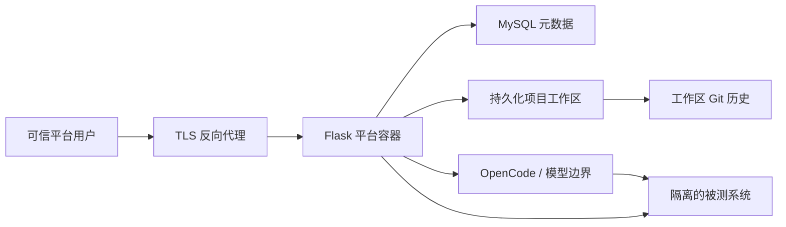
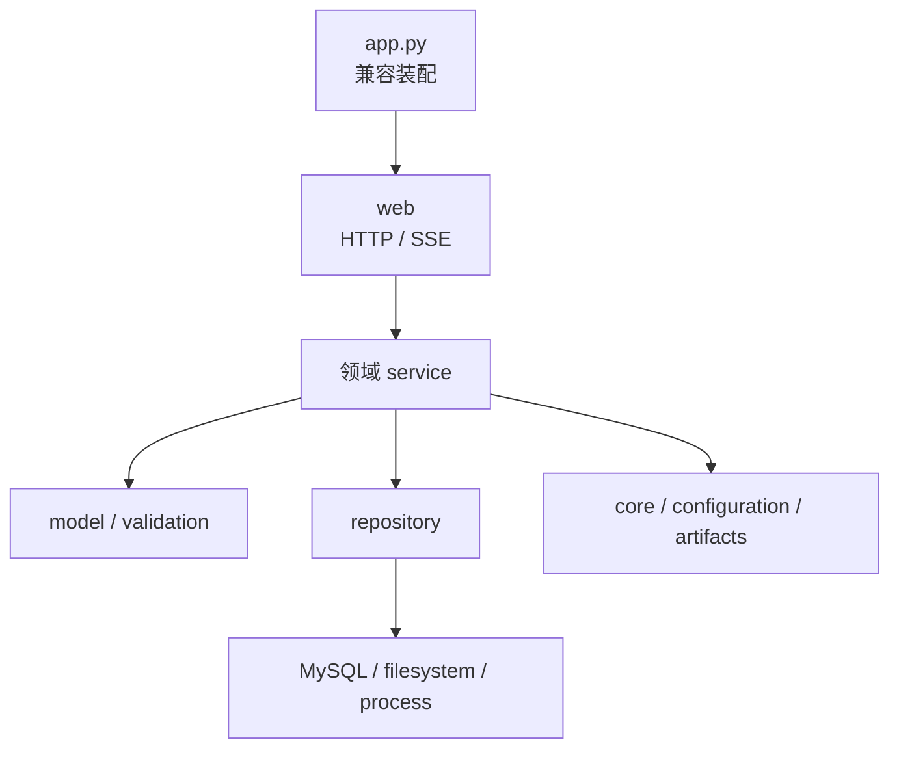

# Architecture

本文描述测试资源编辑器公开 Beta 候选的系统边界、主要组件和数据流。更细的模块
职责与迁移规则见 [ARCHITECTURE.md](../ARCHITECTURE.md)。

## 支持边界

当前架构面向可信环境、单租户、Linux/amd64 Docker 部署。所有平台账号属于同一
组织和信任域，平台位于受控网络中。

当前不提供：

- 不可信租户之间的隔离；
- 公网开放注册或匿名访问；
- 多实例并行调度和高可用；
- Windows 或 macOS 原生生产部署；
- Kubernetes 或跨区域部署保证。

## 系统上下文



图中只表达通用逻辑边界，不代表任何具体部署地址、账号、供应商或私有服务拓扑。

## 主要组件

### Web 应用

Flask 应用负责：

- 登录会话和菜单/API 授权；
- 项目、需求、测试计划、脚本和测试集管理；
- 计划生成、脚本生成、修复和执行任务编排；
- JSON、SSE、文件下载和 HTML 页面交付；
- 将领域服务、存储和外部进程装配到运行时。

`app.py` 仍是兼容装配入口。新领域规则应进入 `test_plan_viewer/` 下的领域模块，而不是继续扩张入口文件。

### MySQL

MySQL 保存平台元数据，例如：

- 项目、用户、角色和权限；
- 资产索引与 revision 元数据；
- 需求、候选模块和测试集；
- 生成、修复、执行与 Agent 任务状态；
- 日志和运行产物的索引。

MySQL 不作为计划 Markdown 或 Playwright TypeScript 的内容版本库。

### 项目工作区

每个项目工作区保存：

- `requirements/` 中的需求文件；
- `specs/` 中的测试计划；
- `tests/` 中的 Playwright 脚本；
- 执行日志、报告、视频、trace 和截图；
- 平台生成的临时文件与恢复信息。

所有请求控制的路径都必须限制在当前项目根目录内，并拒绝绝对路径、`..` 和符号链接逃逸。

### 工作区 Git

平台通过项目工作区内的 Git 历史追踪计划和脚本内容：

- 文件是内容事实来源；
- Git commit 记录内容版本；
- MySQL revision 记录作者、来源、内容摘要和对应 commit；
- 执行记录引用执行时的资产 revision。

工作区 Git 与平台源代码仓库是两个不同的版本边界。

### OpenCode 与模型

OpenCode/模型属于外部信任边界。平台可以向其发送经批准的需求、页面上下文和生成指令，但不得发送明文秘密、生产数据或未获授权的客户资料。

模型输出始终视为不可信输入，必须经过路径、语法、权限和执行前验证。工具权限应限制在当前项目工作区，默认禁止访问工作区外文件和不必要的网络目标。

### 被测系统

被测系统不是平台的可信内部组件。测试页面、DOM、网络响应和下载文件都可能包含恶意或敏感内容。

Beta 只应连接隔离、可恢复、经授权的测试系统，禁止默认连接生产环境。

## 分层结构



依赖方向从交付层指向领域和基础能力：

- `web` 处理 HTTP，不直接写 SQL 或实现核心规则；
- `service` 编排用例，不依赖 Flask 请求上下文；
- `repository` 封装持久化；
- `infrastructure` 提供数据库方言和 schema；
- `core`、`configuration` 和 `artifacts` 提供通用规则；
- 包内模块不得反向导入兼容入口 `app.py`。

## 前端结构

浏览器端不使用打包器，按顺序装载：

```text
static/js/core/*
    -> static/js/features/*
    -> static/app.js
```

`core` 提供 API、SSE 和 timer 等共享能力；`features` 按业务功能拆分；`app.js` 负责页面级状态和最终装配。DOM hook、静态资源顺序和 SSE 终态属于兼容契约。

所有不可信文本优先使用 `textContent`。确需展示 Markdown 时，只能插入经过统一 allowlist sanitizer 处理的 HTML。

## 关键数据流

### 计划或脚本保存

1. Web 层验证请求和权限。
2. 领域服务解析安全目标路径。
3. 文件系统写入候选内容并执行校验。
4. 工作区 Git 创建内容 commit。
5. MySQL 写入或更新资产 revision。
6. 任一步失败时恢复文件和元数据一致性。

### 生成与修复

1. 平台读取当前项目、作者和资产上下文。
2. 运行绑定的测试准备动作。
3. 构建不含秘密的 Prompt。
4. OpenCode 在受限工作区生成候选文件。
5. 平台验证候选文件后再替换正式资产。
6. 记录任务、日志、revision 和失败证据。

### 执行

1. 解析当前脚本 revision 和测试准备绑定。
2. 检查默认关闭的执行开关，并在当前项目工作区运行 Playwright。
3. 持久化任务终态和单脚本结果。
4. 将报告和二进制产物写入文件系统。
5. MySQL 只保存可追踪索引。

“项目工作区隔离”只是路径和数据归属边界，不是敌对代码沙箱。Playwright 与
准备脚本仍和应用共享容器 UID、PID 与文件系统；当前只允许可信单租户使用。

### 后台任务与 SSE

进程内锁和注册表管理当前进程中的取消与互斥；需要刷新后恢复的状态写入 MySQL。后台线程必须显式携带项目和作者上下文。

SSE 的成功、失败、取消和暂停都必须产生可解析终态，并与数据库终态一致。

## 数据所有权

| 数据 | 事实来源 | 备份重点 |
| --- | --- | --- |
| 平台用户、权限、项目、任务和索引 | MySQL | 数据库一致性备份 |
| 需求、计划和脚本 | 项目工作区 | 文件与 Git 一起备份 |
| 内容版本 | 工作区 Git | 保留完整 `.git` |
| 日志、报告、视频和 trace | 项目工作区 | 按保留策略备份 |
| 会话和进程内任务状态 | 运行时 | 不作为持久事实来源 |

## 架构不变量

- 每个请求和后台任务都有明确项目上下文；
- 写操作有明确权限，未映射路由默认拒绝；
- 用户输入、模型输出和被测页面内容均视为不可信；
- 测试与准备执行默认关闭，开启后仍不构成安全沙箱；
- 秘密不进入 Git、Prompt、日志和诊断包；
- 文件内容、Git revision 和 MySQL 元数据保持可恢复一致；
- 单进程锁不能被误认为多实例协调机制；
- 所有部署文档保持环境中立，不记录真实地址、账号和客户资料。

## 相关文档

- [安全模型](./security-model.md)
- [配置参考](./configuration.md)
- [部署指南](./deployment.md)
- [支持矩阵](./support-matrix.md)
