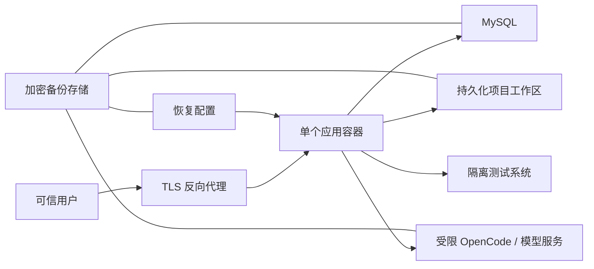

# Deployment

本文定义 Waterfall AI 公开 Beta 的部署基线。只有 GitHub 上已公开、签名验证
通过的 Release 才是安装制品；源码候选只用于可信环境、单租户、单应用实例的
Linux/amd64 Docker 评估。

仓库 [README](../README.zh-CN.md) 提供绑定到本机回环地址的 Compose 快速开始，
适合隔离评估。本页是正式团队部署的运维契约。只有具体公开 Beta Release 实际
附带已验证 bundle 时，才可使用其中以不可变 GHCR digest 引用平台镜像的在线包；
完整离线包只有在其所含第三方镜像均通过再分发审核时才发布。源码树和 NO-GO
模板不等于安装包。部署者应校验 Minisign 签名的 Release manifest、摘要、内部元数据、SBOM、
许可证和 provenance，并确保实际运行镜像与记录的 digest 一致。

## 推荐拓扑



推荐把应用、数据库、模型服务和被测系统放在明确划分的网络中，只开放业务所需流量。平台不应直接暴露在公网。

## 前置条件

- 受支持的 Linux/amd64 主机和 Docker 运行时；当前固定镜像和 Release runtime
  均为单平台 amd64 制品；
- GitHub CLI、Git、Python 3、GNU `tar`、`sha256sum` 和 `zstd`，用于在解包前验证
  Release；
- 对应 Release 中经过验证的在线/离线包，或固定 source release 的 Dockerfile、
  依赖清单和锁文件；
- TLS 反向代理和受控 DNS；
- 独立 MySQL 数据库与最小权限账号；
- 可持久化工作区、Git 历史和执行产物的卷；
- 权限受限的应用配置文件，以及为会话和 Compose 服务提供运行时 secret 的能力；
- 经授权、隔离、可恢复的被测系统；
- 经过组织批准且网络受限的 OpenCode/模型服务。

部署前必须选定并固定一个 Docker 运维身份：经批准的 rootless Docker、专用 Docker
group 账号，或全流程一致的 `sudo` 策略。Docker daemon 权限等同宿主 root 权限；
不得在同一安装中混用提权与非提权命令，以免私有 runtime 和配置产生所有者漂移。

精确组件版本以 Release 元数据、镜像 digest、锁文件和 SBOM 为准，兼容范围见
[支持矩阵](./support-matrix.md)。

## Release 下载、验证与安全解包

下面是 Release bundle 唯一受支持的解包路径。先从受保护 tag 或发布审批记录取得
完整 40 位 `REVISION`，不得只信任短 SHA；`DOWNLOAD_DIR`、`VERIFIER_DIR`、
`EXTRACT_DIR` 和最终 `INSTALL_DIR` 在运行前都必须不存在，且其父目录必须已存在。
示例选择在线包；只有 Release 实际附带离线包时才可改用离线文件名，并给 verifier
额外传入 `--verify-image-archives`。

```bash
set -Eeuo pipefail

OPERATIONS_ROOT=/srv/waterfall-ai-releases
sudo install -d -o "$(id -u)" -g "$(id -g)" -m 0750 "${OPERATIONS_ROOT}"
if git -C "${OPERATIONS_ROOT}" rev-parse --is-inside-work-tree >/dev/null 2>&1; then
  printf 'Operations root must be outside every Git worktree.\n' >&2
  exit 1
fi

REPOSITORY=OWNER/REPOSITORY
TAG=vX.Y.Z
REVISION=REPLACE_WITH_40_CHARACTER_LOWERCASE_TAG_COMMIT
DOWNLOAD_DIR="${OPERATIONS_ROOT}/release-${TAG}-download"
VERIFIER_DIR="${OPERATIONS_ROOT}/release-${TAG}-verifier"
EXTRACT_DIR="${OPERATIONS_ROOT}/release-${TAG}-verified"
INSTALL_PARENT="${OPERATIONS_ROOT}/installed"
INSTALL_DIR="${INSTALL_PARENT}/${TAG}"
COMPOSE_PROJECT="waterfall-ai-$(printf '%s' "${TAG}" | tr '[:upper:].' '[:lower:]-')"
# v0.1.0-beta.3 是改名前发布的不可变历史 Release，保留原制品名。
ASSET_PREFIX=waterfall-ai-test-platform
VERIFY_REPOSITORY="${REPOSITORY}"
if [[ "${TAG}" == "v0.1.0-beta.3" ]]; then
  ASSET_PREFIX=playwright-test-platform
  VERIFY_REPOSITORY="${REPOSITORY%/*}/playwright-test-platform"
fi
BUNDLE="${DOWNLOAD_DIR}/${ASSET_PREFIX}-${TAG#v}-linux-amd64-online.tar.zst"

for path in "${DOWNLOAD_DIR}" "${VERIFIER_DIR}" "${EXTRACT_DIR}" "${INSTALL_DIR}"; do
  [[ ! -e "${path}" && ! -L "${path}" ]] || {
    printf 'Refusing existing path: %s\n' "${path}" >&2
    exit 1
  }
done
install -d -m 0700 "${DOWNLOAD_DIR}"
install -d -m 0750 "${INSTALL_PARENT}"
gh release download "${TAG}" --repo "${REPOSITORY}" --dir "${DOWNLOAD_DIR}"

git clone --no-checkout "https://github.com/${REPOSITORY}.git" "${VERIFIER_DIR}"
git -C "${VERIFIER_DIR}" checkout --detach "${REVISION}"
test "$(git -C "${VERIFIER_DIR}" rev-parse "refs/tags/${TAG}^{commit}")" = "${REVISION}"
test "$(git -C "${VERIFIER_DIR}" rev-parse HEAD)" = "${REVISION}"
install -d -m 0755 "${VERIFIER_DIR}/.release-tools"
bash "${VERIFIER_DIR}/scripts/release/install-minisign.sh" \
  "${VERIFIER_DIR}/.release-tools/minisign"
export PATH="${VERIFIER_DIR}/.release-tools:${PATH}"
minisign -Vm "${DOWNLOAD_DIR}/RELEASE-MANIFEST.json" \
  -x "${DOWNLOAD_DIR}/RELEASE-MANIFEST.json.minisig" \
  -p "${VERIFIER_DIR}/scripts/release/minisign.pub" -H -q
python3 "${VERIFIER_DIR}/scripts/release/verify_release_assets.py" "${DOWNLOAD_DIR}"

VERIFY_IMAGE_ARGS=()
[[ "${BUNDLE}" != *-offline.tar.zst ]] || VERIFY_IMAGE_ARGS+=(--verify-image-archives)
bash "${VERIFIER_DIR}/scripts/release/verify-bundle.sh" \
  --github-repository "${VERIFY_REPOSITORY}" \
  --source-ref "refs/tags/${TAG}" \
  --source-digest "${REVISION}" \
  --release-manifest "${DOWNLOAD_DIR}/RELEASE-MANIFEST.json" \
  --release-signature "${DOWNLOAD_DIR}/RELEASE-MANIFEST.json.minisig" \
  --minisign-public-key "${VERIFIER_DIR}/scripts/release/minisign.pub" \
  "${VERIFY_IMAGE_ARGS[@]}" \
  --extract-to "${EXTRACT_DIR}" \
  "${BUNDLE}"

"${EXTRACT_DIR}/bin/preflight"
"${EXTRACT_DIR}/bin/install" \
  --target "${INSTALL_DIR}" \
  --compose-project "${COMPOSE_PROJECT}"
```

verifier 会先确认签名 manifest 对 bundle 的摘要绑定，再把同一 bundle 复制到权限受限的临时文件，随后检查成员路径、
类型、内部校验和、候选/法律审批绑定和 Release 元数据，最后从这个私有副本直接
复制到全新的 `EXTRACT_DIR`。不要在 verifier 之前手工执行 `tar`，也不要从另一个
tag、分支或历史内部包复制验证脚本。安装完成后，在 `INSTALL_DIR` 中填写生成的
`.env` 和 `config.json`，保持 `0600`，再只用 `./bin/platform-compose` 管理服务。

“离线包”只表示安装时不访问镜像 registry，不表示来源认证可以省略。对隔离目标，
先在联网可信 staging 主机按上面流程验证原始 bundle，并通过独立可信渠道记录该
bundle 的 SHA-256；再用受控、防篡改介质传输同一 bundle、固定 tag verifier 和预期
摘要。隔离侧必须先比较外层摘要，之后才可用 verifier 的
`--allow-unsigned-local --verify-image-archives --extract-to` 重新检查并安全解包。
`--allow-unsigned-local` 只接受这种已经由外部 Minisign 签名和独立摘要绑定的同一字节
副本，不能把 bundle 自带的 `SHA256SUMS` 或 `bin/preflight` 当作外部身份凭据。

## 主机目录

一种通用布局如下：

```text
/srv/test-platform/
  config/       # 只读配置
  workspaces/   # 项目、Git 历史和运行产物
  backups/      # 临时备份落点，不由 Web 进程公开
```

目录应由专用非 root 运行用户拥有。配置目录只读；工作区可写；备份目录不应挂载到 Web 可下载位置。不要挂载用户主目录、宿主机根目录、SSH 目录、云凭据目录或 Docker Socket。

## 部署步骤

1. 按上一节下载同一 Release 的 bundle、签名 manifest 和外层校验材料，并让同一
   可信 tag 的 verifier 通过 `--extract-to` 完成验证后安全解包。
   `RELEASE-METADATA.json` 位于已验证 bundle 内，不应从另一位置单独拼装。源码
   部署则检出带签名或受保护标签的固定提交，在受控流水线构建镜像。
2. 在对目标进行任何写入前执行[安装预检](./upgrade-policy.md)。Release 安装目标
   必须不存在；即使已有目录为空，也要先人工确认并显式移除。Compose project、
   容器和卷也不得命中旧部署。
3. 在仓库外创建 JSON 配置，参考 [配置指南](./configuration.md)。宿主原件保持
   `0600`，只能由专用运维账号读取。
4. 通过 secret store 或运行时环境提供会话和初始管理员秘密；在权限受限的 JSON
   中配置平台数据库、OpenCode 和被测系统凭据。Compose 的数据库/OpenCode
   服务变量必须与 JSON 中对应密码保持一致。
5. 预先创建 MySQL 数据库与最小权限账号，确认字符集和备份策略。
6. 创建专用持久化卷，并验证容器用户只能访问授权项目目录。
7. 创建只允许必要目标的容器网络和出站规则。
8. Release bundle 通过 `./bin/platform-compose`，源码检出通过
   `./deploy/platform-compose` 启动单个应用实例，检查配置解析、数据库迁移、
   OpenCode config/data/cache/state 四卷和工作区权限。源码 `up --build` 只拉取缺失
   的固定 MySQL 镜像、构建一次平台镜像，随后以 no-build/no-pull 启动；Release
   bundle 的 runtime 路径始终禁止构建和拉取。不要绕过包装脚本直接调用 Compose。
9. 在 TLS 反向代理之后开放服务，执行登录、授权拒绝、项目读取和隔离测试运行的冒烟验证。
10. 单独完成一次不含真实数据或秘密的 Provider 认证推理冒烟；容器健康不能替代该检查。
11. 确认日志、截图、trace、视频和诊断包没有秘密后再允许团队使用。
12. 记录镜像摘要、配置版本、schema 版本、部署契约版本和回滚点。

不要在首次启动命令中传递秘密；命令行和进程列表可能被记录。

## 容器加固

应用容器至少应满足：

- 使用非 root 用户；
- 禁用 privileged，不挂载 Docker Socket；
- 删除不需要的 Linux capabilities；
- 只挂载明确的配置和项目目录；
- 根文件系统尽可能只读，临时目录使用受限可写挂载；
- 设置 CPU、内存、PID、文件描述符和临时空间限制；
- 对上传、日志、报告、视频、trace 和工作区设置容量与保留上限；
- 只允许访问 MySQL、批准的模型服务和批准的被测系统；
- 禁止访问云实例元数据、宿主机管理接口和生产网络；
- 为停止和任务取消设置有限宽限期。

Playwright 浏览器和生成工具会处理不可信页面及候选代码。当前测试和准备脚本与
平台进程共享容器的 UID、PID 和文件系统边界，容器内没有额外的敌对代码沙箱。
容器加固只能限制事故影响范围，不能让不可信仓库或不可信用户变得安全。

## 执行开关

- 仓库快速开始在 `.env.example` 和 Compose 回退值中默认开启
  `PLATFORM_ALLOW_TEST_EXECUTION` 与 `PLATFORM_ALLOW_HOST_SCRIPT_EXECUTION`，
  仅适用于可信团队和隔离测试环境。
- 公开、共享或存在不可信用户的部署必须把两个值显式设为 `false`，并重建平台
  服务。需要执行能力时，应先完成仓库、目标、网络、挂载和产物评审。
- 两个开关都只能由可信运维人员控制，不能暴露为普通用户配置。
- 开启开关表示接受代码执行风险，不表示平台提供安全沙箱。

准备脚本通过 `environment_overrides` 接收直接环境值。这些值会持久化到平台数据
库；只允许可信管理员配置，并且不要使用平台数据库、会话、OpenCode、云环境或
生产系统凭据。

## TLS 和反向代理

- 只通过 HTTPS 对用户提供服务；
- 将 HTTP 重定向到 HTTPS；
- 设置 `PLATFORM_COOKIE_SECURE=true`；
- 限制请求体、上传大小、连接数和超时；
- SSE 路由需要关闭不必要的响应缓冲，并配置合理的空闲超时；
- 只转发应用需要的代理头，丢弃客户端伪造的内部头；
- 管理入口应限制到受控网络或组织身份网关；
- 响应头和 Content Security Policy 应由应用与代理共同验证，避免相互覆盖。

如果代理终止 TLS，应用网络仍应只对代理开放。

仓库快速开始为本机 HTTP 设置 `PLATFORM_COOKIE_SECURE=false`。任何 HTTPS 团队
部署都必须改为 `true`，并在代理层验证重定向、Host 与转发头策略。

## 网络和外部服务

| 来源 | 目标 | 原则 |
| --- | --- | --- |
| 可信用户 | TLS 反向代理 | 仅 HTTPS |
| 反向代理 | 应用 | 仅应用监听端口 |
| 应用 | MySQL | 仅数据库端口和平台数据库 |
| 应用 | OpenCode/模型 | 仅批准地址和协议 |
| 应用或浏览器工具 | 被测系统 | 仅隔离测试环境 |
| 应用 | 公网 | 默认拒绝，按必要目标放行 |

模型和被测页面都属于外部信任边界。被测系统账号可能进入模型上下文和生成脚本，
因此只能使用隔离测试系统的可撤销最小权限账号。不要允许模型或页面诱导工具读取
工作区外文件、平台/云凭据或其他运行时秘密。

## 数据与备份

一次可恢复备份必须把以下内容视为同一个恢复点：

- `mysql_data` 中的 MySQL 平台元数据；
- `platform_projects` 中的项目数据、file baseline、lock 和相关运行状态；
- `platform_workspaces` 中的所有工作区文件及每个工作区的 `.git` 历史；
- `opencode_config`、`opencode_data`、`opencode_cache`、`opencode_state` 四个 XDG 卷；
- 恢复所需的 `config.json`、`.env` 和 Release 元数据；这些文件可能包含密码，必须
  与其他机密备份同级保护。

备份应加密、限制访问并设置保留期限。至少定期在隔离环境执行恢复演练，验证文件内容、Git revision 和数据库 revision 仍对应。

仓库不提供通用 `backup`/`restore` 命令。站点 runbook 必须在备份前暂停新任务并停止
写入方（至少 platform 与 OpenCode），对 MySQL 使用其受支持的一致性 dump 或存储
快照机制，再把七个命名卷和配置/Release 元数据绑定到同一批次。恢复只能先落到隔离
Compose project；核对卷 identity、内容摘要、数据库 revision 和 Git revision 后，
才能切换流量。逐个复制仍在写入的卷不构成一致恢复点。

OpenCode 卷可能包含 OAuth/Provider 配置、仓库缓存和日志。执行
`platform-compose repair-opencode-volumes` 前必须先停止 OpenCode，把四卷保存为
同一恢复点，并记录卷 identity 与非秘密 sentinel 的 SHA-256。修复器只应改变四卷
的 owner/group、受控目录 mode，并创建缺失的受控运行目录。镜像、capability、project 或卷解析预检失败
时不改变原服务状态；预检通过并开始改变卷状态后，任何修复或健康失败都应保持
OpenCode 停止，不得删除卷或继续 force-recreate。修复后应复核 sentinel hash、卷
identity、健康状态以及 restart/force-recreate 后的持久性。

执行报告、视频、截图和 trace 可能含 Cookie、个人信息或页面数据，应按机密数据处理。仅备份有明确保留需求的产物。

平台不提供能够可靠覆盖所有自由文本和二进制产物的全局自动脱敏。下载、复制到
工单或发送给模型之前必须人工复核；公开 Issue 不得附原始报告、视频、截图、
trace、数据库转储或配置文件。

## 安装、升级与回滚

当前公开 Beta 只支持全新安装。旧内部包已经退役，不支持从旧包、源码检出、
未知 revision 或缺失 Release 元数据的环境原地升级。当前
`deploy/upgrade-matrix.json` 不包含任何允许路径，安装器必须在写入前调用只读
预检，收到拒绝后停止；不得提供忽略或强制继续开关。完整契约见
[安装与升级策略](./upgrade-policy.md)。

新旧环境必须使用不同 Compose project、数据库、卷和端口。需要保留历史环境时，
先暂停新任务，把 `mysql_data`、`platform_projects`、`platform_workspaces`（含
`.git`）、OpenCode 四个 XDG 卷和 `config.json`/`.env`/Release 元数据保存为同一个
加密恢复点，然后保持旧环境冻结。当前 Release 不提供公开的历史数据导出/导入
工具，不得直接让新版本迁移旧数据库。

全新环境验证失败时，使用受支持 wrapper 执行不带 `-v/--volumes` 的 `down`，把新
环境卷隔离保留并按站点恢复/保留策略处理；当前公开工具故意不提供删除命名卷的
卸载命令，不得自行拼接宽泛的 `docker volume rm` 或 prune。旧环境不需要执行
schema 逆迁移。只有未来 Release Notes 和升级矩阵同时列出精确来源身份时，才按
该版本的迁移、备份和回滚说明操作；回滚必须同时考虑应用、schema、MySQL、
工作区、Git 历史、OpenCode 四卷和恢复配置，而不是只替换镜像。

## 运行检查

部署者应监控：

- 应用进程和经过认证的最小冒烟请求；
- MySQL 连接、迁移状态和容量；
- 工作区、临时目录和日志磁盘用量；
- 生成、修复和执行任务的等待时间、超时与终态；
- SSE 异常断开和后台任务残留；
- OpenCode/模型以及被测系统的连接失败；
- 认证失败、授权拒绝和高风险管理操作。

如果当前 release 没有专用健康端点，应使用进程检查和最小只读请求，不要把会返回项目数据的业务 API 暴露给外部监控。

应把“平台运行健康”与“Agent Provider 就绪”记录为两个独立状态。前者包括容器、
MySQL、登录和只读业务检查；后者必须在 Provider 配置、认证和网络策略完成后，
使用不含秘密的最小推理请求验证。OpenCode `/global/health` 成功或容器显示
`healthy` 只属于前者。

平台和部署脚本不得主动打印 Authorization、Cookie、数据库连接串或平台服务密
码。模型、测试和页面产生的自由文本仍可能带出被测凭据或页面内容，不得依赖自动
脱敏；日志与诊断包必须限制访问并在发布前人工复核。

## 故障处置

发现疑似泄露或入侵时：

1. 隔离入口和受影响容器；
2. 保留受控证据，但不要把原始证据上传到公开 Issue；
3. 轮换会话、数据库、模型和被测系统凭据；
4. 检查工作区及全部 Git 历史；
5. 从已验证恢复点恢复；
6. 按 [SECURITY.md](../SECURITY.md) 私下报告产品漏洞。

## 当前不支持

- 公网直接暴露或开放注册；
- 不可信用户和多租户隔离；
- 多应用副本、高可用和分布式任务协调；
- Kubernetes、跨区域或无服务器部署；
- Windows/macOS 原生生产部署；
- 挂载宿主机 Docker Socket 或使用特权容器；
- 连接生产业务系统执行破坏性测试。
- 从内部包、旧部署或未知来源原地升级。

## 相关文档

- [架构概览](./architecture.md)
- [安全模型](./security-model.md)
- [配置指南](./configuration.md)
- [安装与升级策略](./upgrade-policy.md)
- [支持矩阵](./support-matrix.md)
- [社区支持政策](../SUPPORT.md)
