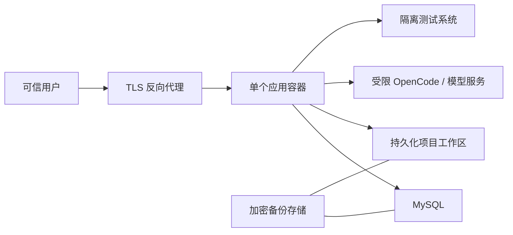

# Deployment

本文定义 Playwright 测试平台公开 Beta 的部署基线。当前只支持可信环境、单租户、
单应用实例的 Linux Docker 部署。

仓库 [README](../README.zh-CN.md) 提供绑定到本机回环地址的 Compose 快速开始，
适合隔离评估。本页是正式团队部署的运维契约。公开 Beta 仅发布源代码；部署者
应从选定 release 的固定提交本地构建镜像，并为最终镜像生成、保存和审查摘要与
SBOM。

## 推荐拓扑



推荐把应用、数据库、模型服务和被测系统放在明确划分的网络中，只开放业务所需流量。平台不应直接暴露在公网。

## 前置条件

- 受支持的 Linux 主机和 Docker 运行时；
- 对应 source release 中经过验证的 Dockerfile、依赖清单和锁文件；
- TLS 反向代理和受控 DNS；
- 独立 MySQL 数据库与最小权限账号；
- 可持久化工作区、Git 历史和执行产物的卷；
- 运行时 secret 注入能力；
- 经授权、隔离、可恢复的被测系统；
- 经过组织批准且网络受限的 OpenCode/模型服务。

精确组件版本以当前 release 的锁文件，以及部署者从最终本地镜像生成的元数据和
SBOM 为准，兼容范围见 [支持矩阵](./support-matrix.md)。

## 主机目录

一种通用布局如下：

```text
/srv/test-platform/
  config/       # 只读配置
  workspaces/   # 项目、Git 历史和运行产物
  backups/      # 临时备份落点，不由 Web 进程公开
```

目录应由专用非 root 运行用户拥有。配置目录只读；工作区可写；备份目录不应挂载到 Web 可下载位置。不要挂载用户主目录、宿主机根目录、SSH 目录、云凭据目录或 Docker Socket。

## 部署步骤

1. 检出带签名或受保护标签的 source release，在受控流水线中从
   `deploy/Dockerfile` 构建镜像，记录不可变摘要并生成、核对 SBOM 和许可证包。
2. 在仓库外创建 JSON 配置，参考 [配置指南](./configuration.md)。
3. 通过 secret store 或运行时环境注入会话、管理员、数据库、模型和被测系统秘密。
4. 预先创建 MySQL 数据库与最小权限账号，确认字符集和备份策略。
5. 创建专用持久化卷，并验证容器用户只能访问授权项目目录。
6. 创建只允许必要目标的容器网络和出站规则。
7. 启动单个应用实例，检查配置解析、数据库迁移和工作区权限。
8. 在 TLS 反向代理之后开放服务，执行登录、授权拒绝、项目读取和隔离测试运行的冒烟验证。
9. 确认日志、截图、trace、视频和诊断包没有秘密后再允许团队使用。
10. 记录镜像摘要、配置版本、schema 版本和回滚点。

不要在首次启动命令中传递秘密；命令行和进程列表可能被记录。

## 容器加固

应用容器至少应满足：

- 使用非 root 用户；
- 禁用 privileged，不挂载 Docker Socket；
- 删除不需要的 Linux capabilities；
- 只挂载明确的配置和项目目录；
- 根文件系统尽可能只读，临时目录使用受限可写挂载；
- 设置 CPU、内存、PID、文件描述符和临时空间限制；
- 对上传、日志、报告、视频、trace 和工作区设置容量与保留上限；
- 只允许访问 MySQL、批准的模型服务和批准的被测系统；
- 禁止访问云实例元数据、宿主机管理接口和生产网络；
- 为停止和任务取消设置有限宽限期。

Playwright 浏览器和生成工具会处理不可信页面及候选代码。当前测试和准备脚本与
平台进程共享容器的 UID、PID 和文件系统边界，容器内没有额外的敌对代码沙箱。
容器加固只能限制事故影响范围，不能让不可信仓库或不可信用户变得安全。

## 执行开关

- `PLATFORM_ALLOW_TEST_EXECUTION` 默认 `false`；只有完成仓库、目标、网络、挂载和
  产物评审后才能显式设为 `true`。
- `PLATFORM_ALLOW_HOST_SCRIPT_EXECUTION` 默认 `false`；公开 Compose 清单始终
  禁用准备 shell。需要该能力时应维护经过专门评审的自定义部署。
- 两个开关都只能由可信运维人员控制，不能暴露为普通用户配置。
- 开启开关表示接受代码执行风险，不表示平台提供安全沙箱。

准备脚本的凭据只能通过 `environment_refs` 引用 `TARGET_*` 变量。不要允许脚本
读取平台数据库、会话、OpenCode 或云环境凭据。

## TLS 和反向代理

- 只通过 HTTPS 对用户提供服务；
- 将 HTTP 重定向到 HTTPS；
- 设置 `PLATFORM_COOKIE_SECURE=true`；
- 限制请求体、上传大小、连接数和超时；
- SSE 路由需要关闭不必要的响应缓冲，并配置合理的空闲超时；
- 只转发应用需要的代理头，丢弃客户端伪造的内部头；
- 管理入口应限制到受控网络或组织身份网关；
- 响应头和 Content Security Policy 应由应用与代理共同验证，避免相互覆盖。

如果代理终止 TLS，应用网络仍应只对代理开放。

仓库快速开始为本机 HTTP 设置 `PLATFORM_COOKIE_SECURE=false`。任何 HTTPS 团队
部署都必须改为 `true`，并在代理层验证重定向、Host 与转发头策略。

## 网络和外部服务

| 来源 | 目标 | 原则 |
| --- | --- | --- |
| 可信用户 | TLS 反向代理 | 仅 HTTPS |
| 反向代理 | 应用 | 仅应用监听端口 |
| 应用 | MySQL | 仅数据库端口和平台数据库 |
| 应用 | OpenCode/模型 | 仅批准地址和协议 |
| 应用或浏览器工具 | 被测系统 | 仅隔离测试环境 |
| 应用 | 公网 | 默认拒绝，按必要目标放行 |

模型和被测页面都属于外部信任边界。不要允许它们诱导工具读取工作区外文件、云凭据或运行时秘密。

## 数据与备份

一次可恢复备份必须把以下内容视为同一个恢复点：

- MySQL 平台元数据；
- 项目工作区文件；
- 每个工作区的 `.git` 历史；
- 恢复所需但不含秘密值的配置版本说明。

备份应加密、限制访问并设置保留期限。至少定期在隔离环境执行恢复演练，验证文件内容、Git revision 和数据库 revision 仍对应。

执行报告、视频、截图和 trace 可能含 Cookie、个人信息或页面数据，应按机密数据处理。仅备份有明确保留需求的产物。

文本脱敏无法可靠处理二进制产物。下载、复制到工单或发送给模型之前必须人工
复核；公开 Issue 不得附原始报告、视频、截图、trace、数据库转储或配置文件。

## 升级与回滚

升级前：

1. 阅读 release notes、迁移说明和安全公告；
2. 在隔离副本验证配置与 schema 迁移；
3. 创建一致性备份并确认可恢复；
4. 记录当前镜像摘要和配置版本；
5. 暂停新的生成、修复和执行任务。

升级时只运行一个应用实例，等待迁移完成后再接收流量。不要用多副本同时执行数据库迁移。

回滚必须同时考虑应用、schema、MySQL 数据、工作区和 Git 历史。若 release 声明 schema 不可向后兼容，应恢复完整升级前快照，而不是只回退镜像。

## 运行检查

部署者应监控：

- 应用进程和经过认证的最小冒烟请求；
- MySQL 连接、迁移状态和容量；
- 工作区、临时目录和日志磁盘用量；
- 生成、修复和执行任务的等待时间、超时与终态；
- SSE 异常断开和后台任务残留；
- OpenCode/模型以及被测系统的连接失败；
- 认证失败、授权拒绝和高风险管理操作。

如果当前 release 没有专用健康端点，应使用进程检查和最小只读请求，不要把会返回项目数据的业务 API 暴露给外部监控。

日志中不得记录 Authorization、Cookie、密码、完整 Prompt、数据库连接串或未脱敏页面内容。诊断包发布前必须人工复核。

## 故障处置

发现疑似泄露或入侵时：

1. 隔离入口和受影响容器；
2. 保留受控证据，但不要把原始证据上传到公开 Issue；
3. 轮换会话、数据库、模型和被测系统凭据；
4. 检查工作区及全部 Git 历史；
5. 从已验证恢复点恢复；
6. 按 [SECURITY.md](../SECURITY.md) 私下报告产品漏洞。

## 当前不支持

- 公网直接暴露或开放注册；
- 不可信用户和多租户隔离；
- 多应用副本、高可用和分布式任务协调；
- Kubernetes、跨区域或无服务器部署；
- Windows/macOS 原生生产部署；
- 挂载宿主机 Docker Socket 或使用特权容器；
- 连接生产业务系统执行破坏性测试。

## 相关文档

- [架构概览](./architecture.md)
- [安全模型](./security-model.md)
- [配置指南](./configuration.md)
- [支持矩阵](./support-matrix.md)
- [社区支持政策](../SUPPORT.md)
