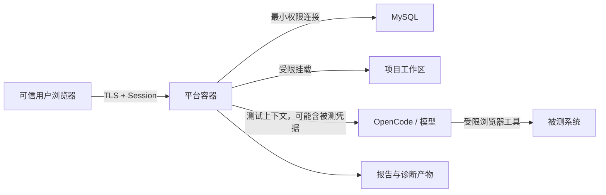

# Security Model

## 目的

本文定义 Waterfall AI 公开 Beta 的信任假设、资产、攻击面和必需控制。它是安全设计边界，
不是公开发行声明，也不是对任意部署形态的安全认证。

漏洞报告流程见 [SECURITY.md](../SECURITY.md)。

## 信任假设

当前只支持可信环境、单租户、Linux/amd64 Docker：

- 用户由同一组织管理；
- 运维人员可以访问平台、数据库和持久化卷；
- 平台位于受控网络并通过 TLS 反向代理访问；
- 被测系统是经授权、隔离且可恢复的测试实例；
- OpenCode 和模型提供方经过组织批准。

即使用户属于同一信任域，平台仍必须防御账号失窃、误操作、恶意文件、被测页面攻击、Prompt injection 和供应链风险。

不假设以下场景安全：

- 不可信租户共享数据库、容器或工作区；
- 任意公网用户上传需求或运行自动化；
- 多副本之间依赖进程内锁协调；
- 容器拥有宿主机 Docker Socket、特权模式或不受限挂载；
- 模型可以访问宿主机或工作区外文件。

## 需要保护的资产

| 资产 | 风险 |
| --- | --- |
| 平台会话和管理员权限 | 账号接管、越权操作 |
| 数据库凭据和模型凭据 | 数据泄露、费用与服务滥用 |
| 被测系统凭据 | 未授权业务访问 |
| 需求、计划和脚本 | 知识产权泄露、恶意代码注入 |
| 工作区 Git 历史 | 历史秘密持续泄露 |
| 日志、报告、视频、截图和 trace | Cookie、页面数据和个人信息泄露 |
| 数据库与备份 | 项目、用户、任务和审计数据泄露 |
| 宿主机与持久化卷 | 路径逃逸、命令执行和横向移动 |

## 信任边界

每次跨越边界都需要验证、授权、最小化数据和可审计记录。

## 主要威胁与控制

### 认证和会话

威胁：

- 默认或弱管理员密码；
- 可预测 session secret；
- Cookie 被窃取或重放；
- 未启用 TLS。

必需控制：

- 启用认证时拒绝空值、占位值和低强度秘密；
- 首次部署使用独立随机 session secret 和管理员密码；
- Cookie 使用 `HttpOnly`、`SameSite`，TLS 部署启用 `Secure`；
- 反向代理只转发必要头，并限制管理入口；
- 密码轮换后使旧会话失效。

### 授权

威胁：

- 新 API 未加入权限映射而被默认放行；
- 只在前端隐藏按钮，后端仍可调用；
- 路径前缀规则误覆盖不同 method。

必需控制：

- 后端授权默认拒绝；
- 按 endpoint 和 HTTP method 定义权限；
- 每个写路由都有允许与拒绝测试；
- 后台任务继承触发者和项目上下文；
- 管理员、项目设置、执行和导入导出能力分开授权。

### Markdown、HTML 和浏览器 DOM

威胁：

- 需求或计划中的原始 HTML 形成存储型 XSS；
- 模型输出包含事件属性、危险 URL 或嵌入内容；
- 动态模板字符串绕过转义。

必需控制：

- 服务端使用统一 allowlist sanitizer；
- 前端插入 HTML 前再次净化；
- 默认使用 `textContent`，禁止直接信任 API 返回的 HTML；
- 禁止脚本、事件属性、危险协议、iframe 和任意样式；
- 配置严格 Content Security Policy，并用回归测试覆盖常见 payload。

### 文件、归档和 Git

威胁：

- `..`、绝对路径、符号链接或大小写差异导致目录逃逸；
- ZIP 炸弹、重复路径、特殊文件和超大归档；
- 恶意 Git 配置、hook 或历史对象；
- 删除或覆盖工作区外文件。

必需控制：

- 所有路径在解析后验证位于项目根目录；
- 导入前限制条目数、展开大小、单文件大小和允许类型；
- 拒绝符号链接、设备文件、绝对路径和路径冲突；
- 平台创建的 Git 操作禁用外部 hook，并限定工作目录；
- 导入、保存和恢复使用候选目录与失败回滚。

### 命令与测试执行

威胁：

- 准备脚本、Playwright 或模型工具执行任意命令；
- 参数拼接导致 shell 注入；
- 执行访问宿主机秘密或生产网络；
- 长任务耗尽 CPU、内存、磁盘和进程。

必需控制：

- 只允许可信管理员配置准备动作；
- 测试执行和准备 shell 只能由部署者控制；仓库演示部署默认开启，不可信部署必须
  显式关闭；
- 优先使用参数数组，避免将请求数据拼入 shell；
- 容器使用非 root 用户、受限挂载和最小出站网络；
- 不挂载 Docker Socket，不使用 privileged；
- 为命令、日志、上传、报告和任务设置超时与容量限制；
- 被测系统使用可恢复测试数据。

当前 Playwright 与准备脚本共享平台容器的 UID、PID、环境和文件系统边界。这一
能力不是安全沙箱，也不能用于不可信仓库、用户或租户。

### 模型与 Prompt injection

威胁：

- 需求或页面诱导模型读取秘密、访问外部目录或外传数据；
- 模型生成危险脚本；
- Prompt、输出和工具日志包含凭据。

必需控制：

- 模型只能看到完成任务所需的最少上下文；
- 被测系统凭据可能进入 Prompt 和生成脚本，只允许使用隔离非生产系统中的可撤销、
  最小权限测试账号，并把模型服务纳入凭据暴露边界；
- 平台会话、数据库、OpenCode、云服务和生产凭据不得提供给模型；
- 默认禁止工作区外目录和不必要工具；
- 限制模型和浏览器工具的出站网络；
- 生成内容先进入候选文件并通过静态与执行验证；
- 限制日志与诊断包访问，并在对外分享前人工复核。

### 数据库

威胁：

- 平台账号权限过大；
- SQL 注入或动态表名；
- 备份未加密或恢复未经验证；
- 多实例迁移和任务竞争。

必需控制：

- 使用独立最小权限数据库账号；
- 查询参数化，标识符通过严格 allowlist；
- 备份加密、限制访问并定期恢复演练；
- schema 迁移幂等且有预检；
- 当前 Beta 只运行一个应用实例。

### 日志和诊断产物

威胁：

- 自由文本、Prompt、HTTP 内容或路径包含秘密；
- 视频、截图和 trace 无法可靠自动脱敏；
- 诊断 ZIP 被误当作公开附件。

必需控制：

- 日志优先使用结构化字段，限制正文、响应和环境变量输出；
- 不依赖全局自动文本脱敏，自由文本在共享前必须人工复核；
- 二进制证据默认不进入诊断包；
- 下载前提示人工复核，产物按敏感数据保存；
- 设置保留期限和安全删除流程。

## 秘密管理

允许：

- 部署平台提供的 secret；
- 进程环境变量；
- 只读挂载且权限受限的秘密文件。
- 未被 Git 跟踪、权限受限的实际 `config.json`；兼容配置中的数据库、OpenCode
  和被测系统密码保存在这里。

禁止：

- 将秘密提交到源代码或工作区 Git；
- 在 JSON 示例中提供可用默认密码；
- 把平台会话、数据库、OpenCode、云服务或生产秘密写入 Prompt、生成脚本、
  Issue、截图或测试快照；
- 在日志中打印 Authorization、Cookie 或完整连接串。

被测系统测试凭据属于兼容例外：它们可能进入计划/脚本 Prompt、登录 Seed、Git
和执行产物，因此必须是专用、可撤销、最小权限的非生产账号，并按机密数据管理
整个链路。“访问目标系统（不登录）”Seed 使用固定模板且不创建模型任务，只将
`base_url` 写入脚本，不使用配置的登录地址、用户名或密码。

秘密泄露后应先轮换，再清理当前文件和全部 Git 历史。仅删除最新版本不等于撤销泄露。

## 数据分级

| 级别 | 示例 | 处理要求 |
| --- | --- | --- |
| 公开 | 已审查的源代码和公共文档 | 可发布 |
| 内部 | 普通测试计划、架构讨论、非敏感日志 | 限组织访问 |
| 机密 | 凭据、需求原文、页面数据、数据库备份 | 加密、最小权限、禁止公开 |
| 高敏感 | 生产数据、认证材料、未修复漏洞 | 不进入 Beta 平台或公共仓库 |

## 发布安全门槛

- 当前树和全部待发布历史通过秘密扫描；
- Markdown/HTML、授权、路径和归档负向测试通过；
- 镜像以非 root 用户运行且不含内部配置；
- source release 提供校验和、项目许可证、第三方声明和锁文件；
- 任何公开分发的容器或离线二进制另行提供最终制品 SBOM 与完整许可证包；
- 文档不含真实地址、账号、客户资料或私有拓扑；
- 从干净 clone 复现构建和测试；
- 高风险未修复问题不得随公开 Beta 发布。

## 相关文档

- [配置参考](./configuration.md)
- [部署指南](./deployment.md)
- [支持矩阵](./support-matrix.md)
- [安全报告流程](../SECURITY.md)
